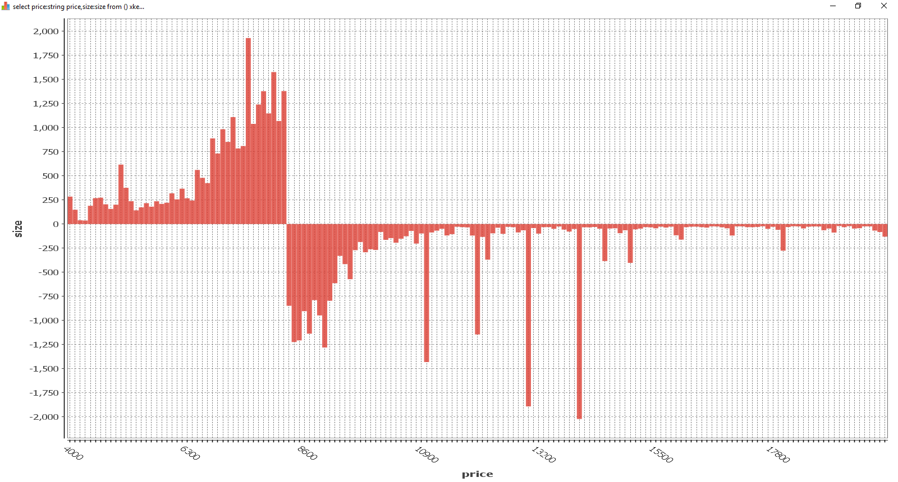

# QOrderBook

OrderBook snapshot for Binance, Kraken, Coinbase, Bitstamp, Bitfinex, bitFlyer, Poloniex, Gemini, itBit, Bittrex.

Pre-requisites:

KDB+ (https://kx.com/connect-with-us/download/)

Start with:

\l qOrderBook.q

View bar chart with qstudio (http://www.timestored.com/qstudio/)

select price:string price,size:size from () xkey select sum size by 100.0 xbar price from orderbook where price within (4000;20000)

# Karma jar

BTC - 112eMCQJUkUz7kvxDSFCGf1nnFJZ61CE4W

LTC - LR3BfiS77dZcp3KrEkfbXJS7U2vBoMFS7A

ZEC - t1bQpcWAuSg3CkBs29kegBPXvSRSaHqhy2b

XLM - GAHK7EEG2WWHVKDNT4CEQFZGKF2LGDSW2IVM4S5DP42RBW3K6BTODB4A Memo: 1015040538

Nano - nano_1ca5fxd7uk3t61ghjnfd59icxg4ohmbusjthb7supxh3ufef1sykmq77awzh

XRP - rEb8TK3gBgk5auZkwc6sHnwrGVJH8DuaLh Tag: 103535357

EOS - binancecleos Memo: 103117718

# Recommended links

Getting started - Coinbase - https://www.coinbase.com/join/bradle_6r

Portfolio balance - Binance - www.binance.com/en/register?ref=LTUMGDDC

Futures trading - Deribit - https://www.deribit.com/reg-8106.6912

Cold wallet - https://atomicWallet.io?kid=12GR52 (promo 12GR52) - https://hodler.tech/

Learn to earn (coinbase users) - Stellar - https://coinbase.com/earn/xlm/invite/vps5dfzt
                               -  EOS - https://coinbase.com/earn/eos/invite/xdbgswqk
                               
                               
